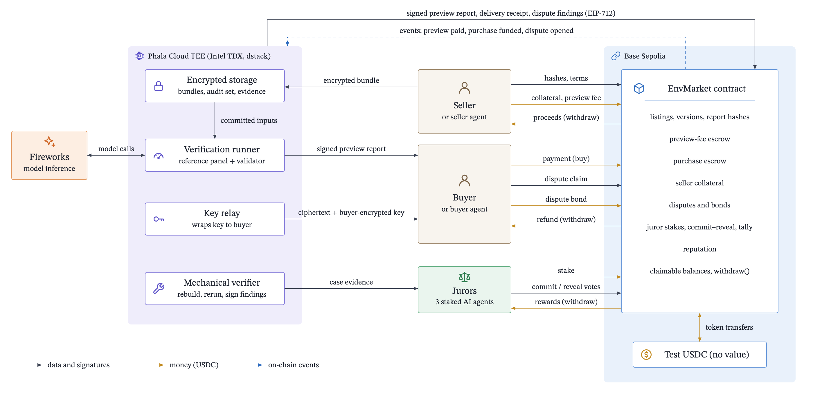
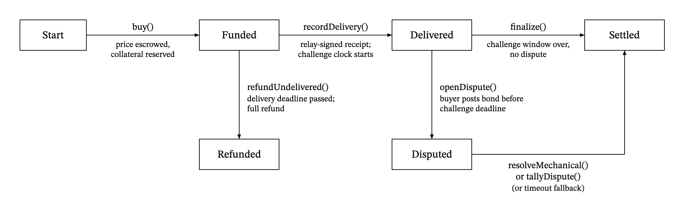

# RL Environment Market

A market for reinforcement-learning environments: task sets, tools and hidden graders that AI labs use to train agents. The product can't be shown before sale. If the seller shows the tasks and tests, the buyer already has them. Sellers are environment builders. Buyers are labs and agent teams running coding RL, often through their own buyer agents. Before paying, a buyer sees a preview signed inside a TEE: how a fixed panel of reference models scores on the sealed environment, plus a screened validator note. After payment enters escrow, the buyer gets the whole environment. The buyer then has a bonded challenge window to claim specific broken or misdescribed tasks. The seller is paid only after that window closes.

The first vertical is **coding-repair environments with hidden unit tests**. The demo listing is `seller-workspace/py-repair-kit`: 5 purchased tasks and 2 undelivered audit tasks. Its description carries one deliberately false claim for the dispute demo (see [SEEDED_DISPUTE.md](seller-workspace/SEEDED_DISPUTE.md)).

## Live

| What | Where |
|---|---|
| App | **TBD** (Vercel URL not yet assigned) |
| Video (≤ 5 min) | **TBD** |
| EnvMarket (Base Sepolia, 84532) | `0x2fd644342296df7de57929fa87bd65c05fb415f8` · [basescan](https://sepolia.basescan.org/address/0x2fd644342296df7de57929fa87bd65c05fb415f8) · [blockscout](https://base-sepolia.blockscout.com/address/0x2fd644342296df7de57929fa87bd65c05fb415f8) |
| EnvMarketViews (read module, delegatecalled from EnvMarket) | `0xf020ec9a3381dfa34a03ad2f8bdb5cae7e890794` · [basescan](https://sepolia.basescan.org/address/0xf020ec9a3381dfa34a03ad2f8bdb5cae7e890794) · [blockscout](https://base-sepolia.blockscout.com/address/0xf020ec9a3381dfa34a03ad2f8bdb5cae7e890794) |
| TestUSDC (`tUSDC`, 6 decimals, public faucet, no value) | `0x6f3600d4a42d0c6c52a8b9f04abf817ce7d56ceb` · [basescan](https://sepolia.basescan.org/address/0x6f3600d4a42d0c6c52a8b9f04abf817ce7d56ceb) · [blockscout](https://base-sepolia.blockscout.com/address/0x6f3600d4a42d0c6c52a8b9f04abf817ce7d56ceb) |
| Phala Cloud TEE app (dstack CVM, Intel TDX) | **TBD**: endpoint, app id, signer and `trust.phala.com` link go here once `deployments/phala-tee.json` exists |

Deployed 2026-09-11 from block 46670333; the full record is in [deployments/84532.json](deployments/84532.json). All calls, views included, go to the EnvMarket address with the merged ABI.

## How it works



1. **List.** The seller agent packages the environment as a canonical tar. It commits the bundle hash, a salted Merkle root over the purchased tasks and a separate root over the audit tasks, then uploads everything encrypted to the TEE. The TEE rechecks every commitment and runs a sandboxed preflight. The seller then calls `createListing` with the hashes, price and collateral.
2. **Preview.** The TEE quotes the inference cost and the seller pays it on-chain (`requestPreview`). The TEE runs one pass@1 episode per model per task through the open-source harness in an offline sandbox. Hidden tests are graded in a separate process. It signs the report (EIP-712) and attaches its hash on-chain, which releases the fee.
3. **Buy.** The buyer checks the report signature, runner role, attestation and description hash in the browser, then calls `buy`. That escrows the price and reserves the seller's collateral for this sale.
4. **Deliver.** The TEE's relay sees `Purchased` and wraps the bundle key to the buyer's X25519 key with HPKE (RFC 9180). It signs a delivery receipt and records it on-chain. The buyer decrypts in the browser and checks the plaintext against `bundleHash`.
5. **Challenge.** Before the challenge deadline, the buyer can claim specific tasks on one of three grounds. *Broken / hash mismatch* and *preview not reproducible* go to the TEE's mechanical verifier, which reruns and signs findings. *False description* goes to three staked AI jurors: they are drawn on-chain, read a case packet from the TEE, and vote by commit-reveal.
6. **Settle and rate.** Upheld claims refund the claimed tasks' share of the price once per task, up to 50%, and slash seller collateral. With no dispute, anyone can call `finalize`. Everything pays out through `withdraw()`. Buyers rate settled purchases, and seller reputation is money-weighted.



The full design is in [docs/RL_ENV_MARKET.md](docs/RL_ENV_MARKET.md), with the dispute diagram at [docs/diagrams/dispute.png](docs/diagrams/dispute.png). The interface contract is [docs/BUILD_SPEC.md](docs/BUILD_SPEC.md).

## What's real, what's testnet

Real:
- **TEE.** One Intel TDX confidential VM on Phala Cloud (dstack) runs the preview runner, key relay, mechanical verifier and evidence server. Its signer comes from Phala's KMS (dstack `GetKey`, deterministic per app id), and a raw Intel DCAP quote whose `report_data` is `sha512(binding)` ties the signer and encryption key to a compose file that pins the image by digest. The web app re-checks the quote through Phala's public verifier, replays RTMR3 and reads the signer's roles from the chain. EigenCompute is still supported (`TEE_VENDOR=eigencompute`) but not deployed: its app quota needs manual EigenLabs approval. Local dev mode exists for tests and labels its reports `none-local-dev`.
- **Inference.** Fireworks serves the reference panel `glm-5p3` (GLM 5.3), `kimi-k3` (Kimi K3) and `qwen3p8-max` (Qwen 3.8). Episodes run in [`harness/envmarket_coding`](harness/README.md), built on Prime Intellect's open-source `verifiers` 0.3.1. The tools are generated from the environment's manifest, and buyers can load the same environment into `vf-eval` or prime-rl. The validator is `deepseek-v4-pro-0813`. The jurors are `deepseek-v4p1-flash`, `gpt-oss-120b` and `glm-5p2`.
- **Crypto.** Bundles are AES-256-GCM. Keys are wrapped with HPKE (RFC 9180), and task commitments use salted OpenZeppelin Merkle trees. Reports, receipts and findings are EIP-712 signatures, verified on-chain.
- **Chain.** Escrow, reserved collateral, delivery and challenge deadlines, three dispute grounds, on-chain juror selection, commit-reveal, tally, majority rewards and minority/non-reveal slashing are all in the contract. So are capped per-task refunds, seller-paid preview fees, reputation and pull payments. Every flow is a real Base Sepolia transaction.
- **Wallets.** Privy handles email, Google or external wallets, and creates an embedded wallet for users who have none.

Testnet: the token is TestUSDC and **has no value**. The stakes, bonds and collateral demonstrate accounting, not economic deterrence. Windows use demo values: a 5 min challenge window where production would use 7 days, a 10 min delivery window, and 3 min each for commit and reveal.

## Trust assumptions

- **Intel TDX, Phala Cloud and Phala's KMS.** Confidentiality of seller bundles, audit tasks and keys depends on TDX and on Phala's KMS operator, who is trusted: with `--kms phala`, that one KMS derives the app key and authorizes compose updates. The attestation shows which compose and image are running, not that they are the right ones.
  - *The developer can push a new image.* I can deploy a new compose or image to the same app id at any time. The quote would show the new compose hash, but nothing on-chain stops the update.
  - *The signer survives upgrades.* The signer is derived from the app id's key, so it stays the same across `phala deploy --cvm-id` updates and keeps its on-chain roles. A different app id gets a new signer, and its roles have to be re-granted.
  - *Storage.* Data lives on the CVM's encrypted disk volume. If the CVM is deleted, undelivered versions fall back to `refundUndelivered`.
- **Fireworks sees task text.** Inference runs outside the attested boundary. During previews, Fireworks sees task statements, workspace files and, for the validator, environment source. During disputes, the jurors' provider sees case excerpts. Production would move inference inside the boundary.
- **One TEE signer holds three roles.** The same KMS-derived key is runner, relay and verifier. If it is compromised, it can sign false reports, false deliveries and false findings. The contract caps the damage at the 50% refund cap plus penalties; it cannot reach escrow or balances directly.
- **The owner key sets roles.** The deployer can change params for future purchases, set the runner, relay and verifier, approve jurors and withdraw the treasury and reserve. It cannot touch escrow, collateral, bonds, stakes or claimable balances. Ownership transfer is single-step, with no multisig.
- **The jurors are three processes I run.** They are allowlisted, use different model families (one shares the GLM family with the panel, which is disclosed) and are not independent. With only three jurors, a round-2 panel can never fill, so a failed round falls back to "no refund, seller paid".
- **Juror randomness is weak.** The seed is `blockhash(selectionBlock)` plus `prevrandao`. On OP-stack chains, prevrandao is the L1 origin's value and is known ahead of time, and the sequencer produces the blockhash. Each juror keeper calls `selectJurors` at the first valid block to shrink the grinding window. Production needs a VRF.
- **A delivery receipt records a key, not a usable one.** A bad key can be disputed as *broken*, but that relies on the verifier.

## Biggest design decision: deliver everything after escrow, then make lying expensive

The buyer can't judge an RL environment without its tasks and grader, and seeing them is having them. So the market does not try to prove quality before sale. It hands over the complete product (source, every purchased task, hidden tests, reference solutions) as soon as payment is escrowed. Protection comes after delivery instead.

I rejected three alternatives:
- **Samples or sandboxed inspection.** With 5–50 tasks per environment, a sample is a large share of the product. A buyer who can run tests in a sandbox can extract them.
- **Keeping the environment in the seller's TEE.** RL training means thousands of rollouts inside the buyer's own training loop (prime-rl, GRPO), close to their GPUs. Running training inside someone else's enclave isn't practical, and GPU TEE coverage for these models isn't available.
- **Holding payment until the buyer approves.** Then the buyer never approves.

What makes after-the-fact protection work:
- **Narrow, checkable claims.** Only three grounds qualify: broken or hash mismatch, a specific false claim in the frozen description, or a preview that doesn't reproduce. Poor training results don't count.
- **Per-task remedies.** Price is split evenly across tasks. A confirmed task is refunded once. Post-delivery refunds are capped at 50%, which limits "copy it, then claim everything".
- **Bonds.** The buyer posts a bond equal to the requested refund (5–50 tUSDC). A rejected bond goes to the jurors and a neutral reserve, never to the seller, so sellers gain nothing from provoking disputes.
- **Collateral per sale.** Each purchase reserves at least `caseFee + 10% of price` of the seller's stake, so one deposit can't back unlimited sales. If confirmed defects exceed 5% of tasks, an extra penalty is slashed.
- **A cheap, bounded pre-purchase signal.** A fixed panel runs a fixed open harness inside the TEE and the report is signed. The seller pays for it (about $1.50–2.13 per preview, measured in [docs/PREVIEW_COST.md](docs/PREVIEW_COST.md)), and it is cached per bundle so it can't be re-rolled.

The cost of this choice is that an honest buyer of a worthless environment recovers at most half the price. That is disclosed before purchase.

## One important limitation: pass@1 is not training value

The preview measures how today's reference models score on the environment. A buyer wants to know whether training on it improves *their* model, and the preview doesn't answer that. In the harness validation, all 12 panel episodes scored 1: the demo tasks are easy. That result shows the environment runs, the grader works and the tasks are solvable. It says nothing about learning signal. Disputes don't close the gap, because "it didn't help my model" is deliberately not a ground. Today the market prices **integrity**: the environment runs, matches its hash, and its claims are true. It does not price usefulness. Next steps would be buyer-model previews in the TEE (a stretch goal) and reputation built from repeat purchases.

Other known gaps: a buyer can keep a copy after a partial refund (only the cap and the bond limit this); the juror pool is thin; appeals to 7 jurors aren't built; reward hacking is out of scope for previews and disputes.

## Run it yourself

Requirements: Node 22, Foundry, Docker (sandbox for seller code), Python 3.12 with `uv` (harness), and a repo-root `.env` built from [.env.example](.env.example). It needs `DEPLOYER/SELLER/BUYER/BUYER2/RUNNER/RELAY/VERIFIER/JUROR1-3` `_PK`/`_ADDR`, `BUYER_ENC_SK/PK`, `BUYER2_ENC_SK/PK`, `FIREWORKS_API_KEY`, and `CHAIN_ID` plus `BASE_SEPOLIA_RPC` for testnet.

```bash
# harness venv (the TEE runs previews through it)
(cd harness/envmarket_coding && uv sync --frozen)

# Full stack in the browser on a private anvil chain: deploy, TEE (local-dev), seller lists
# py-repair-kit with a real Fireworks preview, 3 juror agents, web app on :3100.
scripts/local-stack.sh                 # SKIP_PREVIEW=1 to skip inference; JURORS=1,2 to vote seat 3 by hand

# The whole story headless (list, preview, buy, decrypt, dispute, jurors, refund, finalize, rate)
agents/demo/local.sh                   # logs in agents/.data/local-run/<ts>/
```

Web app against Base Sepolia: run `scripts/sync-web.sh`, then `cd apps/web && npm install && NEXT_PUBLIC_TEE_URL=<tee> npm run dev`. Env vars: `NEXT_PUBLIC_CHAIN_ID` (default 84532), `NEXT_PUBLIC_TEE_URL`, `NEXT_PUBLIC_PRIVY_APP_ID`, and optionally `NEXT_PUBLIC_PRIVY_SPONSOR_GAS=1` and `NEXT_PUBLIC_RPC_URL`. Agents send transactions on anvil and 84532 only, unless `ALLOW_LIVE_TX=1`.

Tests:

| Package | Command |
|---|---|
| `contracts` | `npm ci && forge test` (76 tests; the 6 fork tests need `BASE_RPC`) |
| `packages/shared`, `agents`, `services/jurors`, `services/tee` | `npm install && npm test && npm run typecheck` |
| `services/tee` | `npm run e2e` (anvil e2e with real preview; `E2E_BROKEN_VARIANT=1` adds an upheld mechanical dispute) |
| `services/jurors` | `npm run integration` (anvil commit-reveal round) |
| `apps/web` | `npm run build && npm run lint` |
| `seller-workspace/*` | `scripts/verify.sh --docker` (reference solutions pass, starting states fail, offline) |

## Repo map

```
contracts/          Foundry: EnvMarket (+ Views module via delegatecall), TestUSDC, tests, deploy scripts, security review
packages/shared/    TS library: canonical tar, commitments/Merkle, HPKE key wrap, EIP-712, schemas, LLM client, ABI
services/tee/       The TEE service (Phala Cloud dstack; EigenCompute supported): upload checks, paid previews, key relay, mechanical verifier, evidence
services/jurors/    Three AI juror agents: keeper, case-packet fetch, rubric, commit-reveal, rationale publishing
harness/            envmarket_coding: reference harness on Prime Intellect verifiers 0.3.1 (usable in vf-eval / prime-rl)
agents/             Seller and buyer agent CLIs (package, list, buy, decrypt, inspect claims, dispute), e2e orchestrator
apps/web/           Next.js app with Privy: listings, signed reports, buy/decrypt, disputes, jurors, reputation
seller-workspace/   Two environments: py-repair-kit (demo listing, seeded false claim) and humanevalfix-8 (HumanEvalFix, MIT)
deployments/        Deployed addresses, params and tx hashes per chain
scripts/            local-stack.sh (full local stack), sync-web.sh (ABIs + addresses into the web app)
docs/               Design, build spec + change log, preview cost model, diagrams, take-home brief
research/           Background research on markets for uninspectable information and on choosing a vertical
```

## Security review

[contracts/SECURITY_REVIEW.md](contracts/SECURITY_REVIEW.md) found four issues and fixed all of them, each with a regression test:
- **F-1 (Medium).** Re-arming an expired selection block pushed the grace deadline back, so a panel that could never fill locked escrow forever.
- **F-2 (Low).** A juror could re-roll the panel by toggling their own stake, or stake only after seeing the seed. Each juror now draws independently, and stake must predate the selection block.
- **F-3 (Informational).** Deposits above `uint128` were truncated.
- **F-4 (Low).** A seller could reclaim a preview fee, re-pay the minimum and attach an already-signed report.

Also checked: fund conservation (an invariant fuzzer over every bucket), single settlement, checks-effects-interactions, EIP-712 replay, the delegatecall storage layout and deadline boundaries. Residual risks are listed there: predictable randomness, a thin juror pool, trusted roles, and a report that doesn't bind `ciphertextHash`.
